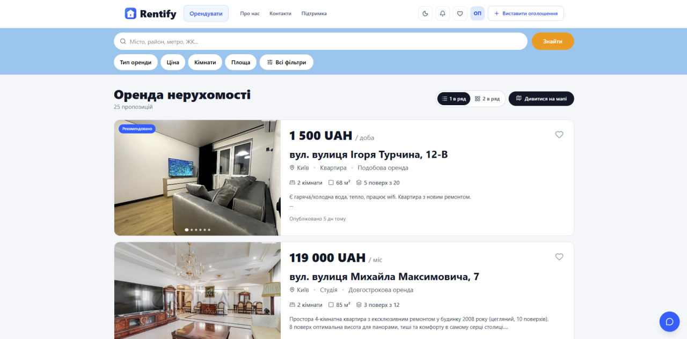
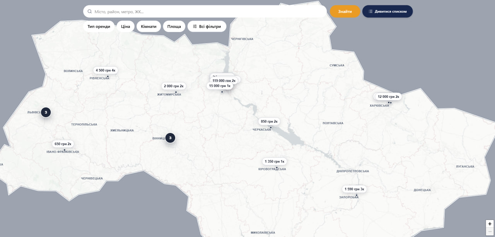
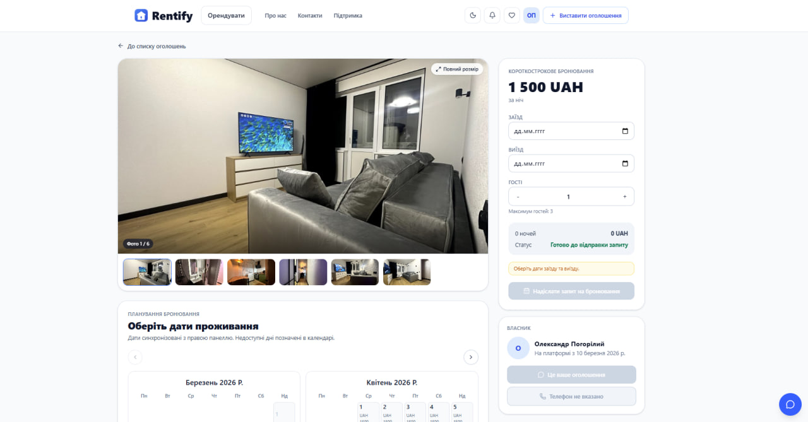
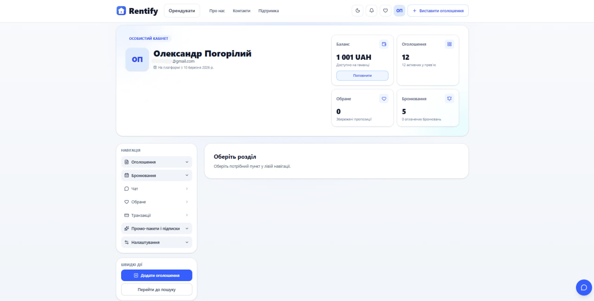
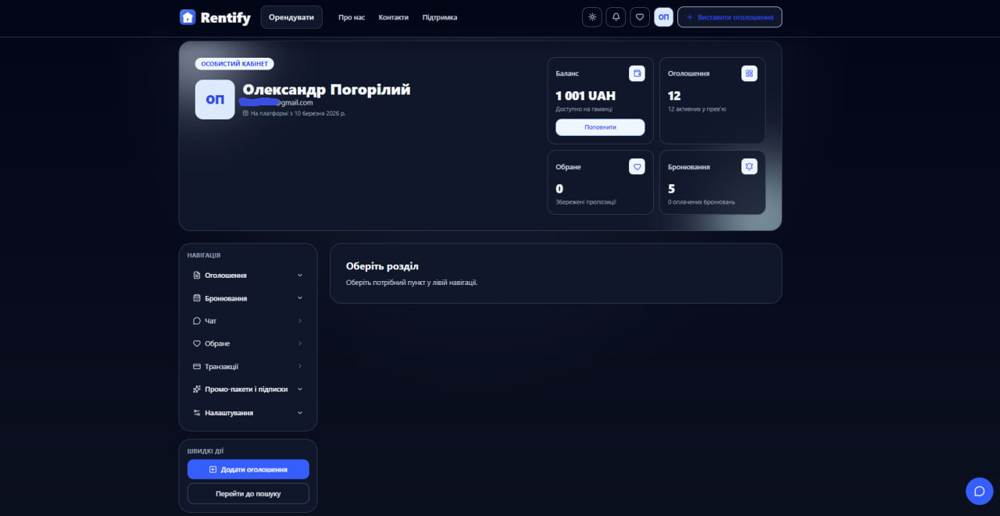
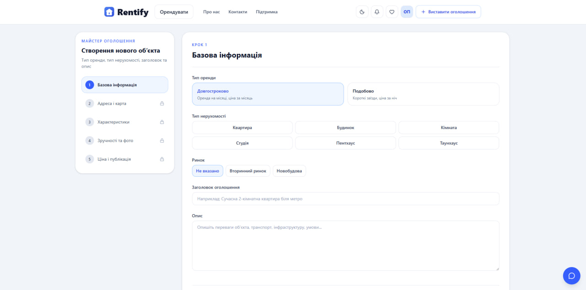

## Rentify Frontend

Rentify is a modern web platform for discovering, listing, and managing real estate rentals in Ukraine.  
This repository contains the **React + TypeScript frontend** that communicates with the Spring Boot backend (`rentify-backend`).

---

## Overview

Rentify delivers a complete rental experience for both guests and authenticated users:

- Guests can search listings, explore the map, view property details, and open public profiles.
- Signed-in users can create and manage their listings, bookings, wallet, promotions, and personal profile.
- The app is built with **production use** in mind: cookie-based authentication, CSRF-compatible backend, optimized UI, and a clear code structure.

---

## Technologies

The frontend is built with a robust and maintainable stack:

- **Core:** React, TypeScript, Vite
- **Data & State:**
  - `@tanstack/react-query` for data fetching, caching, and background updates
  - React Context for theme (`ThemeContext`) and authentication (`AuthContext`)
- **Routing:** React Router
- **HTTP Client:** Axios (configured in `src/services/api.ts` with cookie auth + CSRF headers)
- **Styling & UI:**
  - Utility-first CSS classes (Tailwind-like approach)
  - Responsive, mobile-first layout with modern components (navbar, hero blocks, cards, sidebars)
- **Maps & Search:**
  - Map with clustered pins for property search
  - Location-based search, filters, sorting
- **Auth & Security:**
  - Two auth strategies supported: bearer token or HTTP-only cookie
  - Integration with Spring Security + JWT on the backend
  - CSRF-compatible requests in cookie strategy (header `X-CSRF-Token`)
- **Developer Experience:**
  - Vite dev server with hot module replacement
  - ESLint + strict TypeScript configuration
  - Clearly separated `services`, `hooks`, `components`, and `pages`

---

## Core Features

### Search & Map

- Property search with filters (city, rental type, status, etc.).
- Map view with pin clustering, previews, and quick navigation to property details.
- Separate pages for standard search and map-based search.

### Property Management

- Create, edit, and publish property listings.
- Rich property details: photos, rules, amenities, pricing, and availability calendar.
- Support for blocking specific dates, updating status, and promoting listings.

### Booking & Payments

- Request and manage bookings as a tenant.
- Host and tenant booking views (my bookings vs. bookings for my listings).
- Integration with backend payment logic: wallet transactions and synthetic booking transactions.

### Profile & Wallet

- Personal profile with name, phone, avatar, and account management.
- Wallet view with balance, transaction history, and top-up options.
- Subscription and promotion packages for boosting listings.

### Auth & Session

- Email/password login and registration, plus Google OAuth.
- Session handling powered by `/users/profile` on the backend and a lightweight `UserSessionDto` on the frontend.
- Correct logout flow:
  - `POST /auth/logout` on the backend
  - clearing cookie/token
  - immediate `AuthContext` state update without page reload.

### Chat & Communication

- Built-in chat widget for host–tenant communication.
- Conversation list per property, message history, and background polling.

---

## Screenshots

### Home page


_The landing page with key entry points and quick navigation._

### Search listings



_Search with filters and results list to quickly find the right rental._

### Map search



_Map view with clustered pins for location-first browsing._

### Property details



_A full listing view: photos, rules, amenities, pricing, and availability._

### User profile



_Account area for personal details and profile management._

### Profile (dark mode)



_Dark theme example for comfortable low-light usage._

### Create a listing



_Listing creation flow: fill in the key details and prepare it for publishing._

## Frontend Behavior

- **Guests**
  - Can use the home page, search pages, map, property details, public profiles, and static info pages (about, contacts, support).
  - Are redirected to the login page when trying to access protected actions (creating listings, booking, accessing profile).
- **Authenticated users**
  - Get access to profile, listings, bookings, wallet, promotions, and chat.
  - See navigation and UI adapt to the authentication state via `AuthContext`.
- Sensitive pages (profile, settings, wallet, bookings, promotions) are excluded from search indexing, while public content is SEO-friendly (meta tags, canonical URLs configured in `AppRouter`).

---

## Repository Structure

Branching model:

- **main** – stable branch prepared for deployments and production releases.
- **dev** – active development branch.

Key directories:

- `src/pages` – top-level pages (Home, Search, SearchMap, Profile, PropertyDetails, Login, Register, Wallet, etc.).
- `src/components` – reusable UI components (Navbar, Footer, profile sections, search widgets, property cards).
- `src/hooks` – business logic encapsulated in React hooks (search, profile, property details, chat, API wrappers).
- `src/services` – API clients and adapters (user, property, booking, payment, wallet, promotions).
- `src/config` – shared configuration (API endpoints, routes, React Query client, env).
- `src/contexts` – global contexts (authentication, theme).
- `src/types` – DTOs and domain types aligned with the backend.

---

## Getting Started

### Prerequisites

- Node.js (LTS recommended, e.g. 18+)
- Running backend `rentify-backend` (default: `http://localhost:8080`)

### Installation

1. Clone the repository:

```bash
git clone https://github.com/polchduikt/rentify-frontend.git
cd rentify-frontend
```

2. Install dependencies:

```bash
npm install
```

3. Configure environment variables:

Create `.env` (or `.env.local`) in the project root:

```env
VITE_API_BASE_URL=/api/v1
VITE_DEV_API_PROXY_TARGET=http://localhost:8080

# Auth strategy: 'cookie' (HTTP-only cookie) or 'bearer' (Authorization header)
VITE_AUTH_STRATEGY=cookie

VITE_CSRF_COOKIE_NAME=csrf_token
VITE_CSRF_HEADER_NAME=X-CSRF-Token

# Optional: Google OAuth client configuration
VITE_GOOGLE_CLIENT_ID=your_google_oauth_client_id
```

4. Start the development server:

```bash
npm run dev
```

By default, the app runs on `http://localhost:5173` and proxies API requests to the backend target you configured.

---

## API Highlights (from the Frontend Perspective)

The frontend relies on the REST API provided by `rentify-backend` (Spring Boot). Common endpoints:

- **Auth**
  - `POST /api/v1/auth/login`
  - `POST /api/v1/auth/register`
  - `POST /api/v1/auth/google`
  - `POST /api/v1/auth/logout`
- **Users**
  - `GET /api/v1/users/profile`
  - `PUT /api/v1/users/profile`
  - `PATCH /api/v1/users/profile/password`
  - `POST /api/v1/users/profile/avatar`
  - `DELETE /api/v1/users/profile/avatar`
  - `GET /api/v1/users/{id}/public`
- **Properties**
  - `GET /api/v1/properties/search`
  - `GET /api/v1/properties/search/map-pins`
  - `GET /api/v1/properties/{id}`
  - `POST /api/v1/properties`
  - `PUT /api/v1/properties/{id}`
- **Bookings, Wallet, Payments, Promotions**
  - Dedicated routes under `/api/v1/bookings/**`, `/wallet/**`, `/payments/**`, `/promotions/**` used throughout the UI.

For full API details, see the backend repository and its OpenAPI/Swagger documentation.

---

## Project Status

The project is under active development. Current priorities include:

- further performance optimizations for search and map views,
- improved UX for profile, chat, and wallet flows,
- finer-grained promotion and subscription tools for property owners.

---

## License

The project is currently in the development stage
